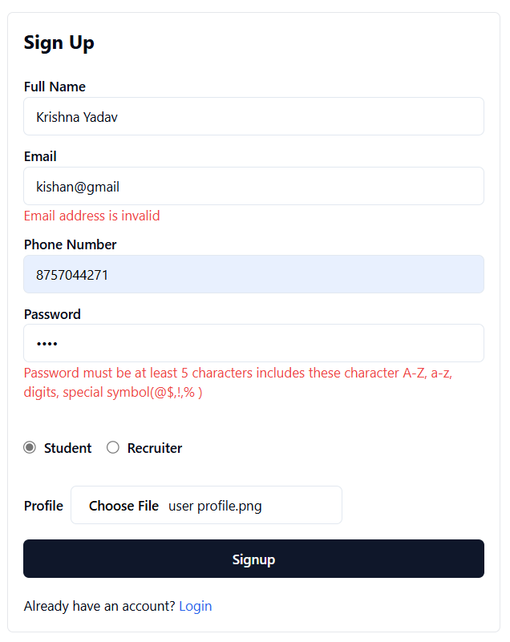
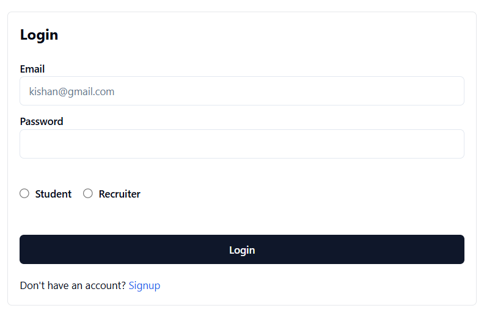
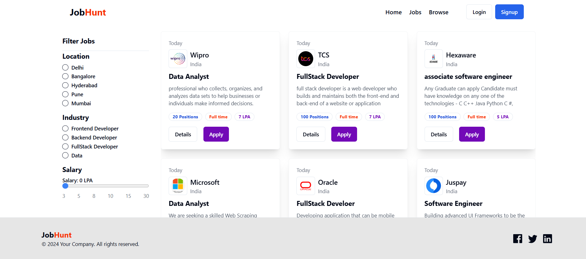
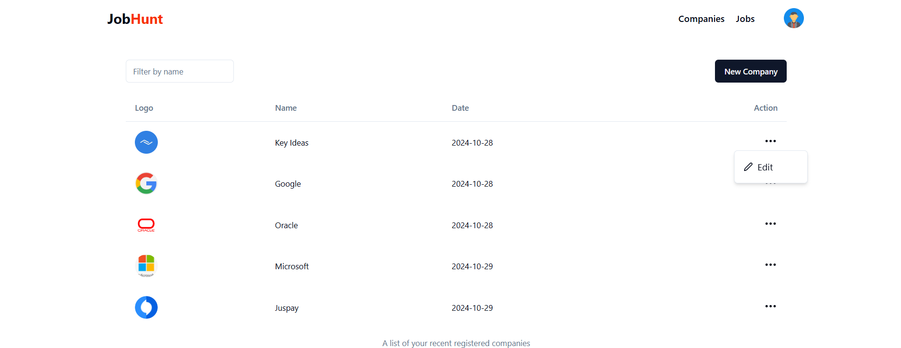

# Job Seek

Job Seek is a full-stack job application platform allowing users to manage profiles, search and apply for jobs, and upload resumes. Recruiters can create jobs, register companies, and manage applicant applications, making it a comprehensive solution for job seekers and employers alike. The project leverages various technologies on both the frontend and backend to provide a smooth and secure experience.

## Features

### User Functionality
- **User Authentication**: Secure signup and login using JWT and session tracking.
- **Profile Management**: Users can manage their profiles and view all jobs they’ve applied to.
- **Resume Upload**: Users can upload a PDF resume using Multer for file handling.
- **Job Search & Filtering**: Users can browse available jobs, filter by category, and search by keywords.
- **Job Application**: Users can view job details and apply for positions directly from the platform.

### Recruiter Functionality
- **Company Management**: Recruiters can register their company on the platform.
- **Job Posting**: Recruiters can create job postings and view applicant details.
- **Application Management**: Recruiters can accept or reject applications based on the applicant’s qualifications.

## Tech Stack

### Frontend
- **React.js**
- **HTML**
- **CSS** / **Tailwind CSS**

### Backend
- **Node.js**
- **Express.js**
- **MongoDB**

## Project Insights
This project provided valuable learning experiences, showcasing the workflow of larger projects and integrating multiple technologies to build a feature-rich application.

## Screenshots

### Home Page


### Signup


### Login


### Job Listings


### User Profile


### Add Job


### Add Company


### Recruiter Page


## Installation

1. **Clone the repository:**
   ```bash
   git clone https://github.com/yourusername/job-seek.git
   cd job-seek
